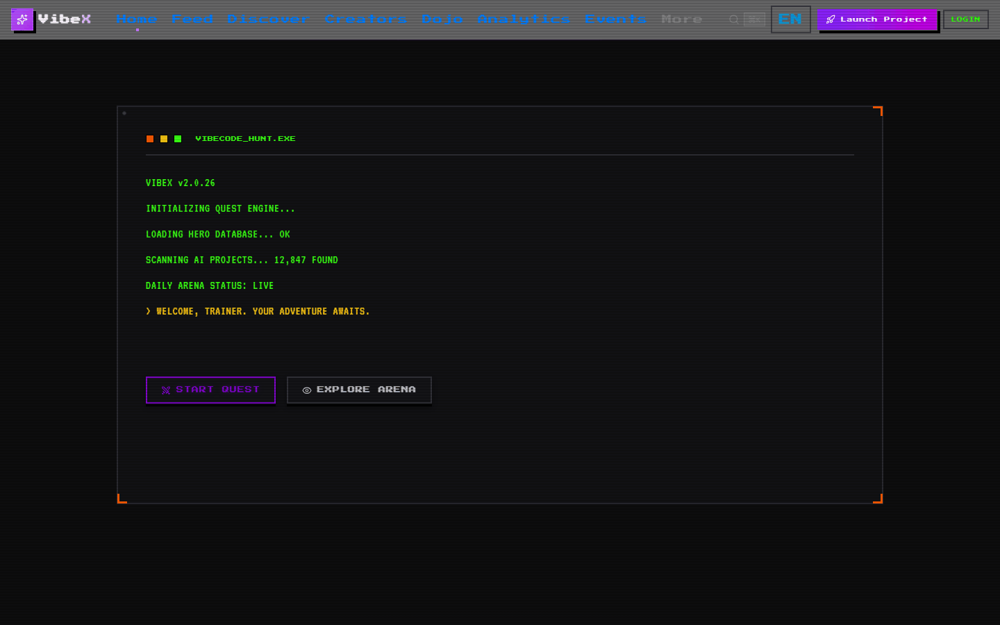
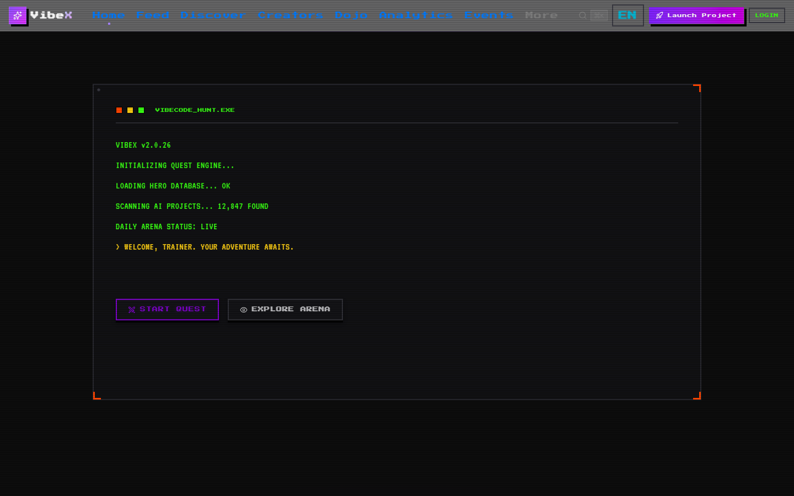
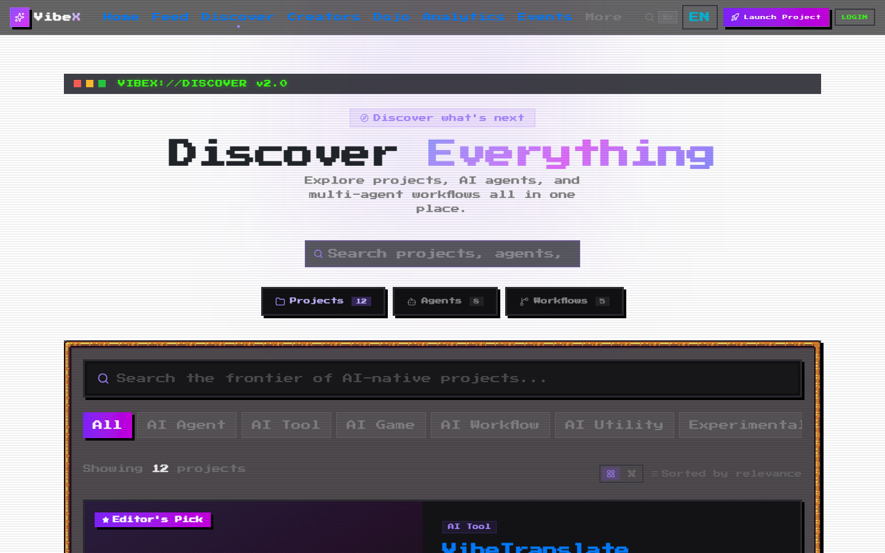
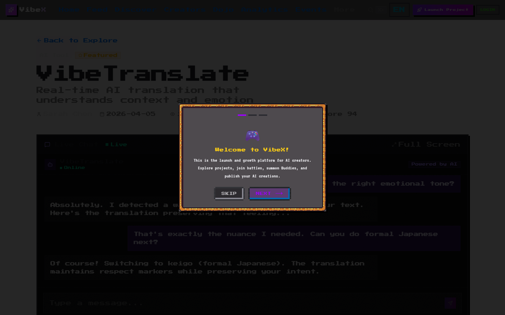
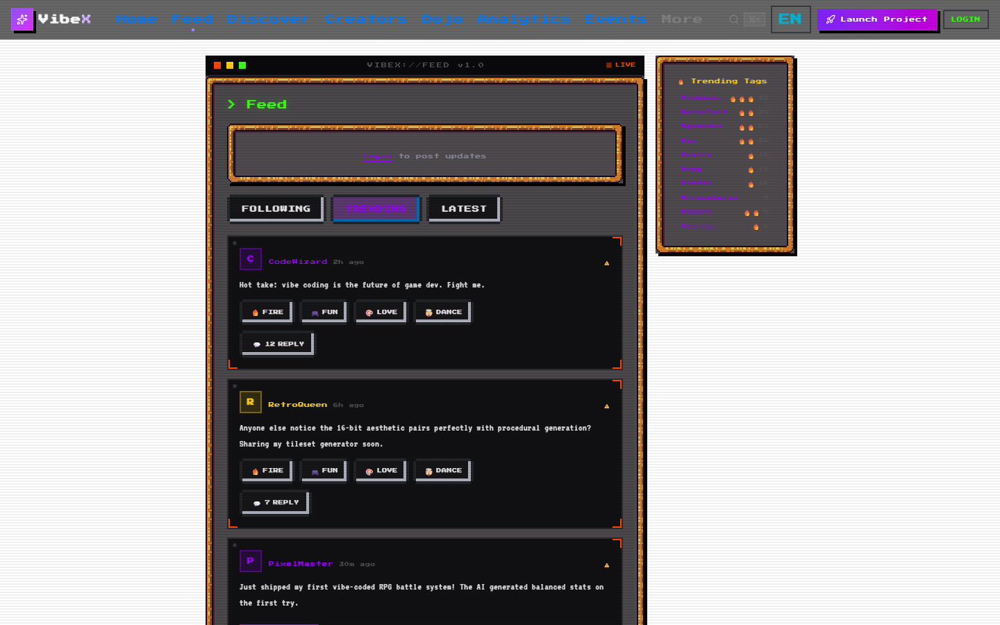
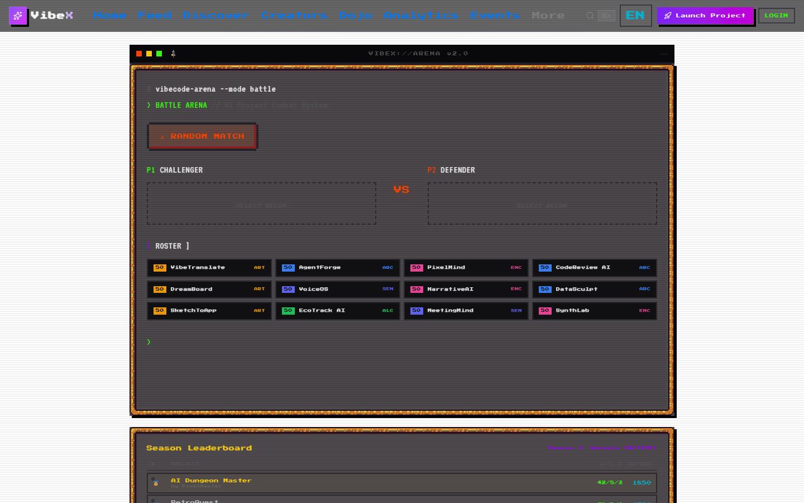
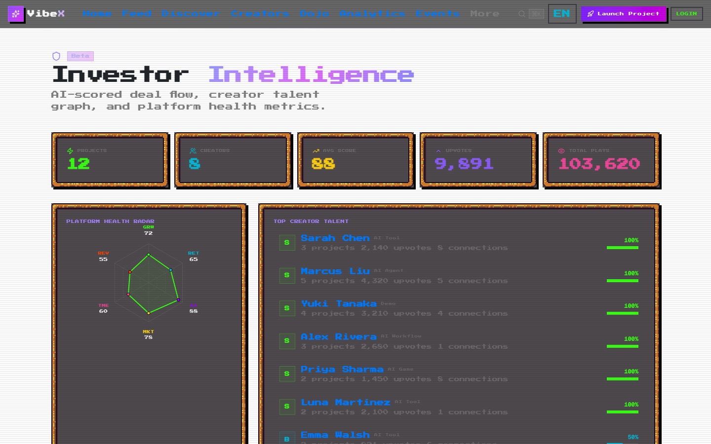

<p align="center">
  
</p>

<h1 align="center">VibeX</h1>

<p align="center">
  <strong>Turn your AI project into a viral, evolving collectible.</strong>
</p>

<p align="center">
  <a href="https://www.vibexforge.com"></a>
  <a href="#-quick-start"></a>
  <a href="https://github.com/alex-jb/vibex"></a>
</p>

<p align="center">
  <a href="https://www.vibexforge.com">Website</a> &bull;
  <a href="#-how-it-works">How It Works</a> &bull;
  <a href="#-core-features">Features</a> &bull;
  <a href="#-architecture">Architecture</a> &bull;
  <a href="#-quick-start">Quick Start</a> &bull;
  <a href="./CONTRIBUTING.md">Contributing</a>
</p>

<p align="center">
  <a href="https://github.com/alex-jb/vibex"></a>
  <a href="https://github.com/alex-jb/vibex/commits"></a>
  <a href="https://nextjs.org"></a>
  <a href="https://supabase.com"></a>
</p>

---

VibeX is a gamified growth platform for AI creators.  
We transform AI projects into shareable, collectible cards that evolve based on real-world traction.

---

## The Problem

Building AI products has never been easier.  
Getting attention has never been harder.

Creators struggle with:
- No distribution after launch
- Low visibility — projects disappear in 48 hours
- No ongoing growth loop
- Product Hunt is one-shot, not continuous

---

## The Solution

VibeX turns every AI project into a **living, evolving asset**.

### How it works:

**1. Create** — Upload your AI project

**2. Generate** — Instantly turn it into a collectible Hero Card

**3. Evolve** — Your project levels up based on real traction (views, likes, shares)

**4. Share** — Export a viral card with QR code to bring traffic back

---

## Growth Loop

```
Create → Card → Share → Traffic → Level Up → Share again
```

This creates a **built-in distribution engine** for every creator.

---

## Core Features

### AI Project Cards
Generate beautiful, pixel-style collectible cards with HP/MP/EXP bars, rarity badges, skill tags, and QR codes. Three sizes: 3:4 (Xiaohongshu), 1:1 (Instagram), 16:9 (Twitter/X).

### 6-Stage Evolution System
Projects evolve automatically based on real metrics:

| Stage | Rarity | Trigger |
|-------|--------|---------|
| Seed | Common | Just created |
| Active | Uncommon | 50+ plays or 40+ score |
| Growing | Rare | 500+ plays, 50+ upvotes, 1K+ views |
| Breakout | Epic | 1K+ plays, 100+ upvotes, 70+ originality |
| Legend | Legendary | 5K+ plays, 500+ upvotes, 85+ score |
| Myth | Mythic | 10K+ plays, 1K+ upvotes, VC interest |

### Share-to-Grow
Cards are designed for social platforms with built-in QR codes. Download → Post → Scan → Traffic → Level Up.

### Auto Demo Generator
One-click: input URL → Playwright captures frames → animated GIF cover for your project.

### Growth Signals
Track engagement, evolution progress, and unlock higher tiers. Creator Dashboard with trend charts.

### VC Dashboard
Investor intelligence: radar charts, talent graph, deal flow table ranked by AI score.

---

## Why VibeX

| Platform | Limitation |
|----------|-----------|
| Product Hunt | One-time launch |
| GitHub | No discovery |
| X (Twitter) | High noise |
| **VibeX** | **Continuous growth loop** |

---

## Screenshots

| Home | Discover | Project Detail |
|------|----------|----------------|
|  |  |  |

| Feed | Arena | VC Dashboard |
|------|-------|-------------|
|  |  |  |

---

## Monetization (Planned)

- Card upgrades (Rare / Epic / Legendary visual skins)
- Featured placement on discover page
- Growth insights (AI-powered analytics)
- Premium Agent marketplace

---

## Tech Stack

| Layer | Technology |
|-------|-----------|
| **Framework** | Next.js 16 (App Router, Turbopack) |
| **Language** | TypeScript 5 (strict) |
| **UI** | React 19 + Tailwind CSS 4 + Framer Motion |
| **Design** | NES.css + RPGUI (16-bit pixel aesthetic) |
| **Database** | Supabase (PostgreSQL, RLS, Realtime) |
| **Auth** | Supabase Auth (GitHub + Google OAuth) |
| **AI** | Claude API (launch packages, reviews, growth) |
| **Monitoring** | Sentry + PostHog |
| **CI/CD** | GitHub Actions + Vercel |

---

## Quick Start

**Runs in 30 seconds with zero config.** No API keys, no database, no sign-up.

```bash
git clone https://github.com/alex-jb/vibex.git
cd vibex
npm install
npm run dev
```

Open http://localhost:3000 — the app runs in **mock mode** with built-in demo data.

<details>
<summary><strong>Want real data? Configure Supabase + Claude (optional)</strong></summary>

```bash
cp .env.local.example .env.local
# Fill in: NEXT_PUBLIC_SUPABASE_URL, NEXT_PUBLIC_SUPABASE_ANON_KEY, ANTHROPIC_API_KEY
npm run dev
```

See [CONTRIBUTING.md](./CONTRIBUTING.md) for setup details.

</details>

---

## Architecture

```
vibex/
├── app/                   # Next.js 16 App Router
│   ├── feed/              # Social timeline (realtime)
│   ├── discover/          # Project browser
│   ├── dojo/              # Training hub
│   ├── arena/             # Battle simulator
│   ├── launch/            # AI Launch Copilot
│   ├── vc/                # VC dashboard
│   └── api/               # 43 API routes
├── components/            # 105+ React components
│   ├── rpg/               # Pixel UI (hero card, battle HUD, skill tree)
│   ├── feed/              # Social (posts, reactions, mentions)
│   ├── home/              # Landing page sections
│   └── vc/                # Investor dashboard
├── lib/
│   ├── ai.ts              # Claude API integration
│   ├── battle-engine.ts   # 6-attribute combat
│   ├── buddy-system.ts    # Pet + gacha system
│   ├── data-moat.ts       # Growth intelligence
│   └── i18n.ts            # 708 translation keys (EN/ZH)
├── supabase/migrations/   # Schema (48 tables)
└── .private/              # Proprietary core (not in repo)
```

**Data flow:** Browser → Next.js API routes → Supabase (PostgreSQL + Realtime) + Claude API → Response.

---

## License & Source Model

VibeX is **source-available**, not fully open source. Here's what that means:

### Public (this repo)
- All UI, components, pages, API routes
- Public stubs of core logic (compile + run with demo behavior)
- Schema overview

### Private (not in this repo)
- Claude AI prompt templates (the secret sauce)
- Battle engine combat math
- Gacha/evolution probability tuning
- Growth intelligence algorithms
- Full migration history with RLS policies

**You can:** fork, study, learn from, and contribute to the public parts. Run it locally. Build on top of it for personal/educational use.

**You can't:** use it commercially without permission. See [LICENSE](./LICENSE).

Want to contribute? See [CONTRIBUTING.md](./CONTRIBUTING.md).

---

## Vision

To become the **growth layer for AI creators**,  
where every project is not just launched — but evolves.

---

## Status

Early-stage MVP. Actively building the core growth loop. Join the beta at [vibexforge.com](https://www.vibexforge.com).

---

## Support the Project

If VibeX inspires you or helps you ship your AI project:

<p align="center">
  <a href="https://github.com/alex-jb/vibex"></a>
  <a href="https://www.vibexforge.com/"></a>
</p>

Stars help other AI creators discover VibeX. It's the single most impactful thing you can do if you like this.

---

<p align="center">
  Built with vibe coding energy by <a href="https://github.com/alex-jb">Orallexa</a>
</p>
