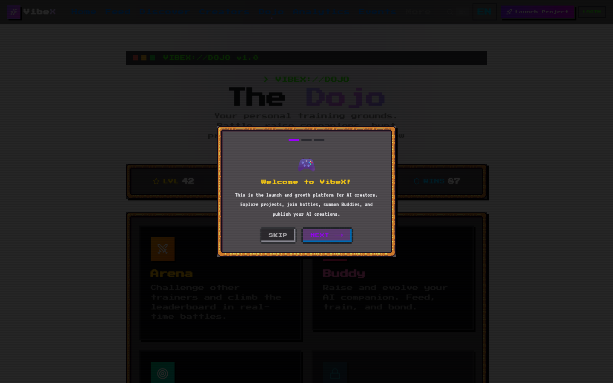

<p align="center">
  
</p>

<h1 align="center">VibeX</h1>

<p align="center">
  <strong>The launch & growth platform for AI-native creators.</strong><br/>
  <em>16-bit RPG aesthetic meets AI-powered creator economy</em>
</p>

<p align="center">
  <a href="https://www.vibexforge.com">Website</a> &bull;
  <a href="#-getting-started">Getting Started</a> &bull;
  <a href="#-features">Features</a> &bull;
  <a href="#-tech-stack">Tech Stack</a> &bull;
  <a href="#-contributing">Contributing</a>
</p>

<p align="center">
  <a href="https://github.com/alex-jb/vibex"></a>
  <a href="https://github.com/alex-jb/vibex/commits"></a>
  <a href="https://github.com/alex-jb/vibex/issues"></a>
  <a href="./LICENSE"></a>
  <a href="https://nextjs.org"></a>
  <a href="https://supabase.com"></a>
</p>

---

## What is VibeX?

> **Launch your AI product. Get feedback, distribution, and growth — in one platform.**

VibeX is where AI creators publish projects, get AI-powered launch packages, track growth metrics, and compete on leaderboards. It's ProductHunt meets Pokemon, wrapped in a 16-bit RPG pixel art aesthetic and powered by Claude API.

**Not just another AI directory.** VibeX is a growth engine. Upload your project -> get a complete launch package (positioning, copy, social threads, investor pitch) -> distribute -> track -> optimize -> grow.

---

## Features

### AI Launch Copilot
One-click launch package generation. Upload your project, get everything you need to ship:
- **Positioning** — one-liner, target audience, problem/solution, unique value
- **Copy** — Product Hunt description, elevator pitch, tagline
- **Social** — Twitter/X thread, LinkedIn post, Reddit post
- **Distribution** — channel strategy with priority ranking + timing
- **Investor Pitch** — problem, solution, market, traction, ask
- **Competitor Analysis** — differentiation from 2-3 competitors
- **Demo Script** — 30-second video script

### Project Analytics & Growth
Track your project's performance and get AI-powered growth suggestions:
- Views, clicks, shares, upvotes trend charts (pixel-style)
- Conversion rate tracking
- AI growth advisor — actionable recommendations with effort estimates
- Category benchmarks — how you compare to similar projects

### RPG Gamification & 6-Stage Evolution
Everything is a game. Every action earns XP. Every project is a sprite that evolves.
- **6-Stage Project Evolution** — Seed → Active → Growing → Breakout → Legend → Myth
- **Auto-triggered by metrics** — plays, upvotes, shares, AI score, VC interest
- **Evolution animations** — pixel particle burst effects on stage transitions
- **50-level Creator System** — 10 named ranks from Novice to Legend
- **Arena Battles** — Projects fight with 6-attribute combat, Elo rankings
- **Buddy Pets** — 11 pixel creatures x 3 evolution stages, gacha summoning
- **Buddy-Project Linkage** — project evolution awards creator EXP

### Hero Achievement Cards
Generate and share beautiful 16-bit RPG share cards:
- **3 sizes** — 3:4 (Xiaohongshu), 1:1 (Instagram), 16:9 (Twitter/X)
- **RPG data** — HP/MP/EXP bars, rarity badge, skill tags, AI catchphrase
- **QR code** — pixel-art QR links directly to project page
- **One-click download** — share on any social platform

### Auto Demo Generator
One-click demo generation from any URL:
- Input project URL → Playwright auto-scrolls → captures key frames → GIF
- Pure JS pipeline (no FFmpeg) — works on Vercel Serverless
- Auto-fills project thumbnail for waterfall display

### AI Agent Marketplace
Build, share, and run AI agents:
- Visual Agent Builder (model, tools, prompts)
- Multi-agent Workflow orchestration
- 8 built-in tools (web search, code analysis, translation...)
- Star ratings & reviews from the community
- Install tracking + version history

### Social Feed
Twitter-style engagement loops:
- Post with reactions + media attachments (image/GIF)
- @Mentions with autocomplete + notifications
- #Hashtags auto-extraction + trending sidebar
- Algorithmic feed (HN-style engagement scoring)
- Real-time new post notifications
- Content moderation (report, auto-flag, admin queue)

### Growth Intelligence
Data that gets more valuable over time:
- **Creator Graph** — skills, connections, success rate, growth velocity
- **Product Graph** — success/failure signals across projects
- **Growth Patterns** — 8 verified patterns (timing, copy, channel, strategy)
- **Category Benchmarks** — average D1/D7 views, upvotes, conversion rates

### VC Dashboard
Investor intelligence for AI project discovery:
- **Platform Health Radar** — 6-axis chart (growth, retention, AI innovation, market, team, revenue)
- **Talent Graph** — top creators ranked by success rate
- **Deal Flow Table** — projects sorted by investor curiosity score

### Platform Infrastructure
- **DM System** — realtime conversations via Supabase Realtime
- **PWA** — service worker, offline pixel-art fallback, installable
- **Push Notifications** — Web Push API for mentions/replies
- **Image Upload** — avatars + thumbnails via Supabase Storage
- **Share Tracking** — card downloads, copies, referral visits
- **Admin Panel** — moderation queue + analytics dashboard
- **Creator Dashboard** — personal analytics with trend charts
- **Waterfall Layout** — responsive CSS columns masonry grid
- **SEO** — semantic HTML, Schema.org, sitemap, OG images
- **i18n** — English / Chinese / Japanese (720+ keys)

---

## Screenshots

| Home | Discover | Project Detail |
|------|----------|----------------|
|  |  |  |

| Feed | Dojo |
|------|------|
|  |  |

---

## Stats

| Metric | Count |
|--------|-------|
| Pages | 35 |
| API Routes | 43 |
| DB Tables | 48 |
| Tests | 247 unit + 33 E2E |
| Components | 105+ |
| i18n Keys | 708 (EN/ZH) |
| AI Endpoints | 9 (Claude API) |
| Buddy Forms | 15 (5 x 3 evolutions) |

---

## Tech Stack

| Layer | Technology |
|-------|-----------|
| **Framework** | Next.js 16 (App Router, Turbopack) |
| **Language** | TypeScript 5 (strict) |
| **UI** | React 19 + Tailwind CSS 4 + Framer Motion |
| **Design** | NES.css + RPGUI (16-bit pixel aesthetic) |
| **Database** | Supabase (PostgreSQL, 48 tables, RLS) |
| **Auth** | Supabase Auth + GitHub OAuth |
| **AI** | Claude API (launch packages, reviews, growth analysis) |
| **Realtime** | Supabase Realtime (feed, chat, notifications) |
| **Testing** | Vitest (247 unit) + Playwright (33 E2E) |
| **CI/CD** | GitHub Actions + Vercel (auto deploy) |
| **Monitoring** | Sentry + PostHog |

---

## Getting Started

```bash
# Clone
git clone https://github.com/alex-jb/vibex.git
cd vibex

# Install
npm install

# Configure
cp .env.local.example .env.local
# Fill in: NEXT_PUBLIC_SUPABASE_URL, NEXT_PUBLIC_SUPABASE_ANON_KEY, ANTHROPIC_API_KEY

# Run
npm run dev
```

> **No Supabase?** The app works in mock mode without a database. All features use built-in demo data.

### Commands

| Command | Description |
|---------|-------------|
| `npm run dev` | Development server (Turbopack) |
| `npm run build` | Production build |
| `npm test` | Unit tests (Vitest) |
| `npx playwright test` | E2E tests |

---

## Architecture

```
+---------------------------------------------+
|                  BROWSER                     |
|  Next.js App Router + React 19              |
|  NES.css + RPGUI + Framer Motion            |
+---------------------------------------------+
|              API ROUTES                      |
|  /api/feed    /api/ai    /api/agents        |
|  /api/arena   /api/messages  /api/admin     |
+---------------------------------------------+
|         SUPABASE (PostgreSQL)                |
|  48 tables + RLS + Realtime + Auth          |
|  RPC functions (toggle_like, toggle_react)  |
+---------------------------------------------+
|           CLAUDE API                         |
|  Launch Copilot + Growth Advisor            |
|  Project Review + Idea Eval + Trends        |
+---------------------------------------------+
```

<details>
<summary>Directory Structure</summary>

```
app/
  ├── feed/              # Social timeline (realtime)
  ├── discover/          # Project browser + search
  ├── dojo/              # Training hub
  ├── arena/             # Battle simulator + leaderboard
  ├── buddy/             # Pet collection + trade
  ├── launch/            # Launch Copilot (AI package gen)
  ├── insights/          # Trend analysis + growth intel
  ├── messages/          # DM inbox
  ├── admin/             # Moderation + analytics
  ├── creators/          # Creator graph
  ├── developers/        # API docs + developer portal
  └── api/
      ├── ai/            # 9 AI endpoints (Claude)
      ├── feed/          # CRUD + reactions + reports
      ├── agents/        # Run + stream + reviews
      ├── arena/         # Leaderboard
      ├── growth/        # Patterns + benchmarks
      └── messages/      # DM system
lib/
  ├── ai.ts              # Claude API (9 functions)
  ├── feed.ts            # Realtime feed hook
  ├── buddy-system.ts    # Pet + EXP + gacha
  ├── battle-engine.ts   # RPG combat
  ├── data-moat.ts       # Creator/Product/Growth graphs
  └── i18n.ts            # 708 translation keys (EN/ZH)
```
</details>

---

## Contributing

Contributions welcome! Please read the [DESIGN.md](./DESIGN.md) for the design system spec before building UI.

```bash
# Run lint
npx eslint .

# Run tests
npm test

# Build check
npm run build
```

---

## License

Source Available License. Free for personal and educational use. Commercial use requires permission.

---

<p align="center">
  Built with vibe coding energy by <a href="https://github.com/alex-jb">Orallexa</a>
</p>
