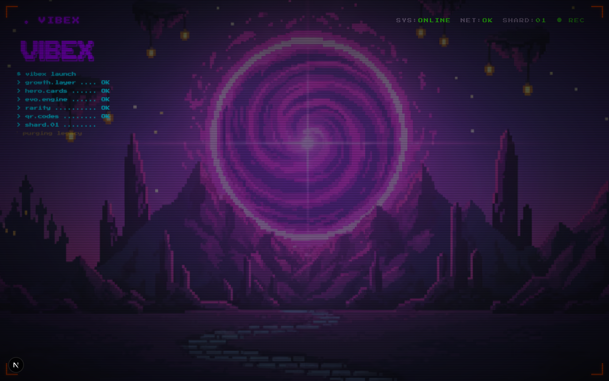
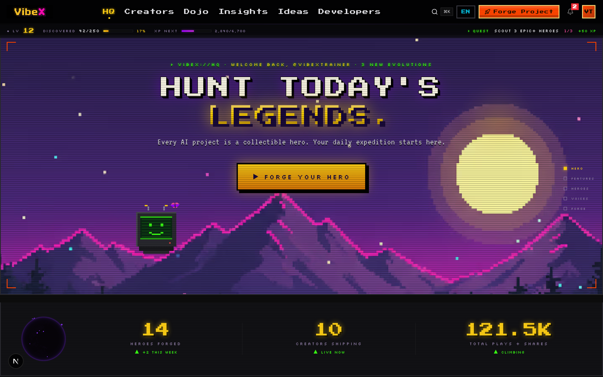
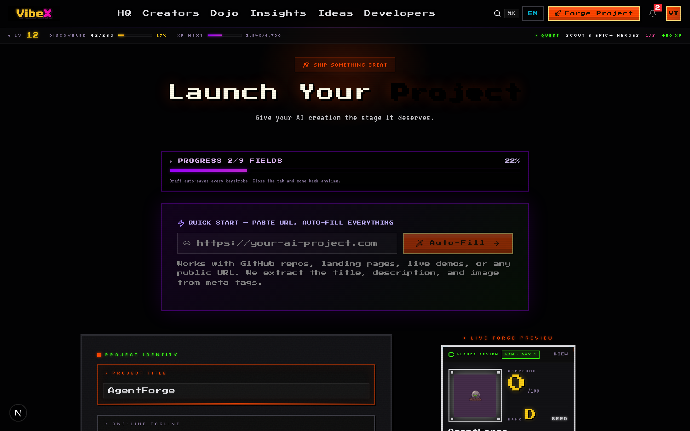
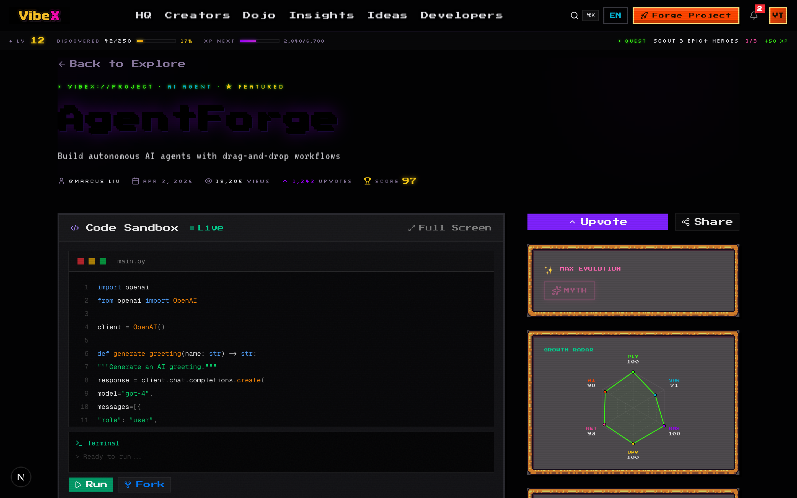
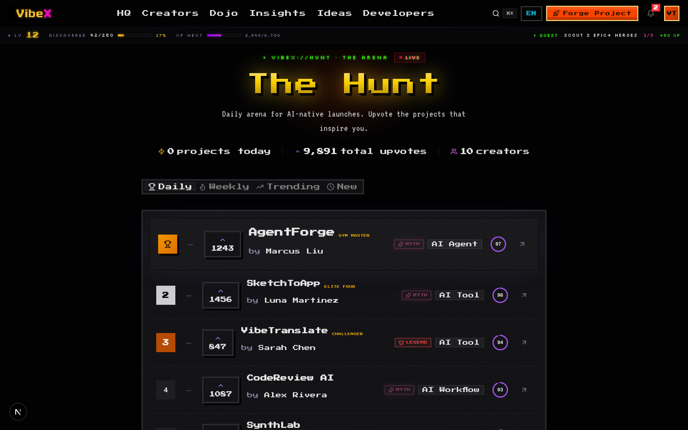
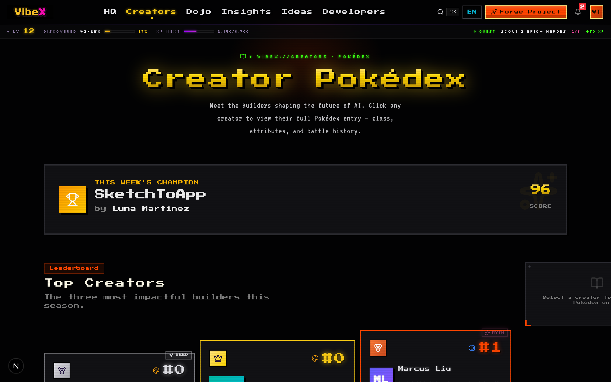

<p align="right">
  <strong>English</strong> · <a href="./README.zh-CN.md">中文</a>
</p>

> ## 🚀 Launching on Product Hunt — **May 1, 2026**
>
> The forge ignites at **PST 12:01 AM** (Beijing 5/1 15:01). Star this repo so you don't miss it. [⭐ Notify me on GitHub](https://github.com/alex-jb/vibex/subscription) · [Try it now](https://www.vibexforge.com)

<p align="center">
  <a href="https://www.vibexforge.com">
    
  </a>
</p>

<h1 align="center">VibeXForge</h1>
<p align="center"><sub>formerly <strong>VibeX</strong></sub></p>

<p align="center">
  <strong>Turn your AI project into a collectible RPG hero.</strong><br/>
  <sub>Submit a URL or GitHub repo → Claude scores it across 5 dimensions (originality, clarity, UX, virality, investor curiosity) → it evolves <code>Seed → Active → Growing → Breakout → Legend → Myth</code> on real plays + upvotes + shares. Not a 24-hour upvote sprint. A gallery that rewards projects that <em>actually improve</em> after launch day.</sub>
</p>

<p align="center">
  <a href="https://www.vibexforge.com/launch"></a>
  <a href="#-quick-start"></a>
  <a href="https://github.com/alex-jb/vibex"></a>
</p>

<p align="center">
  <a href="https://github.com/alex-jb/vibex"></a>
  <a href="https://github.com/alex-jb/vibex/commits"></a>
  <a href="https://github.com/alex-jb/vibex/actions/workflows/ci.yml"></a>
  <a href="./LICENSE"></a>
  <a href="https://www.typescriptlang.org/"></a>
  <a href="https://nextjs.org"></a>
  <a href="https://supabase.com"></a>
  <a href="https://anthropic.com"></a>
  <a href="./CONTRIBUTING.md"></a>
</p>

---

## Demo

https://github.com/alex-jb/vibex/releases/download/v0.1.0-demo/vibex-demo.mp4

> **Live:** [vibexforge.com/launch](https://www.vibexforge.com/launch) — sign in with GitHub, paste any URL, get a real Claude review in ~30 seconds.

---

## The Problem

Everyone's vibe coding now. Building is easy. **Getting seen is the bottleneck.**

You ship an AI project, post the link, and hear nothing. The code is fine. The landing page is killing the click-through. Weak headline, too many buzzwords, no clear value in the first 5 seconds.

Solo builders don't have a design team, a copywriter, or a growth advisor. They ship a README and hope.

## The Loop

VibeXForge is that advisor, powered by Claude.

```
Paste URL → Claude reviews like a stranger → 5-7 concrete fixes → Apply → Score climbs
```

**1. Forge** — Paste your project URL. We scrape the page, parse the pitch, index your README.

**2. Review** — Claude reads it like a first-time visitor and returns 5-7 structured actions. Each has a clear headline, why it matters, and a copy-pasteable suggestion.

**3. Apply** — Click Apply on any action. Come back next week, rerun. Watch the score climb.

The gamification (pixel art cards, evolution stages, realtime leaderboard) makes shipping feel like leveling up instead of shouting into the void.

---

## Screenshots

|  |  |
|---|---|
|  |  |
| **Portal** — every session starts here | **HQ** — your projects + 3D globe + leaderboard |
|  |  |
| **Launch** — paste URL, forge plates ignite, anvil strikes | **Project** — forge-unveil animation + Claude review panel |
|  |  |
| **Hunt** — realtime leaderboard, makers voting | **Creators** — ranked by what they shipped |

---

## Quick Start

**Runs in 30 seconds. Zero config.** No API keys, no database, no sign-up.

```bash
git clone https://github.com/alex-jb/vibex.git
cd vibex
npm install
npm run dev
```

Open http://localhost:3000. The app runs in **mock mode** with built-in demo data.

> ### 🎮 Got it running?
> If the Direction A forge aesthetic + the Claude review flow caught your eye, **[⭐ star the repo](https://github.com/alex-jb/vibex)**. It costs you a click and helps us land on Product Hunt's "trending OSS" list on May 1.

<details>
<summary><strong>Want real data? Wire up Supabase + Claude (optional)</strong></summary>

```bash
cp .env.local.example .env.local
# Fill in:
#   NEXT_PUBLIC_SUPABASE_URL
#   NEXT_PUBLIC_SUPABASE_ANON_KEY
#   ANTHROPIC_API_KEY
npm run dev
```

Run the SQL migrations in `supabase/migrations/*.sql` through the Supabase Dashboard SQL editor. Full setup in [CONTRIBUTING.md](./CONTRIBUTING.md).

</details>

---

## Tech Stack

| Layer | Choice | Why |
|-------|--------|-----|
| Framework | Next.js 16 (App Router, Turbopack) | Server Components + streaming |
| Language | TypeScript 5 (strict) | Refactor fearlessly |
| UI | React 19 + Tailwind v4 + Framer Motion | Zero-config, fast, smooth |
| Design | nes-core.css + custom pixel tokens | 16-bit aesthetic, ~50KB CSS |
| DB | Supabase (Postgres + RLS + Realtime) | One stack, one auth, realtime out of the box |
| Auth | Supabase Auth (GitHub + Google OAuth + PKCE) | Cookies, not localStorage |
| AI | Claude Sonnet 4.6 with tool_use | Structured JSON reviews, not prose |
| Visual | [cobe](https://github.com/shuding/cobe) 3D globe | 5KB, zero deps, global community feel |
| Monitoring | Sentry + HyperDX | Server errors + browser session replay |
| Analytics | OpenPanel | Cookieless product analytics + funnel events |
| Video | Remotion + gpt-image-1 | Per-project trailers rendered from parametric compositions |
| Deploy | Vercel + GitHub Actions | `git push` = prod |

---

## Architecture

```
vibex/
├── app/                      # Next.js 16 App Router
│   ├── page.tsx              # Landing (the portal)
│   ├── home/                 # HQ dashboard
│   ├── hunt/                 # Realtime leaderboard
│   ├── launch/               # Forge a project → AI review
│   ├── project/[id]/         # Project detail + review history
│   ├── ideas/                # Idea Lab (pre-build scoring)
│   ├── creators/             # Builder profiles + rankings
│   └── api/                  # 57 REST + streaming endpoints
├── components/
│   ├── rpg/                  # Pixel chrome (cards, evolution badges)
│   ├── cobe-globe.tsx        # Spinning 3D globe
│   └── ideas/                # Idea Lab components
├── lib/
│   ├── ai.ts                 # Claude tool_use wrapper
│   ├── realtime.ts           # Supabase realtime hooks
│   └── i18n.ts               # ~925 strings (EN / zh bilingual)
├── proxy.ts                  # Supabase SSR auth middleware
├── public/llms.txt           # AI search engine discoverability
└── scripts/                  # QA, perf audit, demo recorder tools
```

---

## Roadmap

**Shipped**
- [x] GitHub + Google OAuth (PKCE, cookie-based)
- [x] Project submission + URL scrape + auto title cleaning
- [x] Claude structured review (5-7 actions per review)
- [x] Apply / Skip / Reject action persistence
- [x] Realtime leaderboard (Supabase `postgres_changes`)
- [x] Direction A visual system — forge/pixel/RPG character sheet
  vocabulary across every user-facing surface: AIReviewPanel,
  HeroCard (grid + share + OG image), /launch (live preview +
  forge plates + STRIKE THE ANVIL + post-submit "forging" animation),
  /hunt, /creators, /ideas, /dojo, /events, /insights, /profile,
  /workflows, /agents — single color token canon across 20+ components
- [x] Forge-unveil animation on `/project/[id]?forged=1` — frame
  color reveal + compound count-up + staggered bar fill
- [x] Interactive 3D globe (cobe)
- [x] GEO optimization (llms.txt, AI crawler rules)
- [x] Bilingual UI (EN / zh, ~925 strings)
- [x] Automated demo video recorder with TTS narration
- [x] Parametric Remotion `ProjectTrailer` — 720×720 10s loops rendered
  per seed project with forge-style mockup frames (gpt-image-1 pipeline)
- [x] OpenPanel funnel analytics + HyperDX session replay (both env-gated,
  no-op silently on preview deploys)

**Next**
- [ ] First 10 real users through the feedback loop
- [ ] Weekly re-review reminders
- [ ] Public review feed on creator profiles

**Later**
- [ ] Multi-reviewer (Claude + GPT + Gemini cross-check)
- [ ] Auto-apply low-risk copy changes (with diff preview)
- [ ] Creator-to-creator peer review marketplace

---

## Star History

<a href="https://star-history.com/#alex-jb/vibex&Date">
  <picture>
    <source media="(prefers-color-scheme: dark)" srcset="https://api.star-history.com/svg?repos=alex-jb/vibex&type=Date&theme=dark" />
    <source media="(prefers-color-scheme: light)" srcset="https://api.star-history.com/svg?repos=alex-jb/vibex&type=Date" />
    
  </picture>
</a>

> **Why star this?** This is what an AI-native launch platform looks like when a solo dev ships daily for two weeks. The forge aesthetic, the Claude review flow, the bilingual i18n, the parametric Remotion trailer pipeline — all in the open. ⭐ this if you'd rather follow the live build than read another whitepaper.

---

## License

Source-available. All UI, pages, API routes, and components are public. Claude prompt templates, scoring tuning, and full migration history are private.

**You can:** fork, study, run locally, contribute to the public parts.
**You can't:** use it commercially without permission. See [LICENSE](./LICENSE).

---

<p align="center">
  <strong>If you're shipping an AI project this week:</strong><br/>
  <a href="https://www.vibexforge.com/launch">Try the live loop on your own URL</a> and tell me which suggestions landed.<br/><br/>
  <a href="https://www.vibexforge.com"></a>
  <br/><br/>
  Built with vibe coding energy by <a href="https://github.com/alex-jb">Orallexa</a>
</p>
