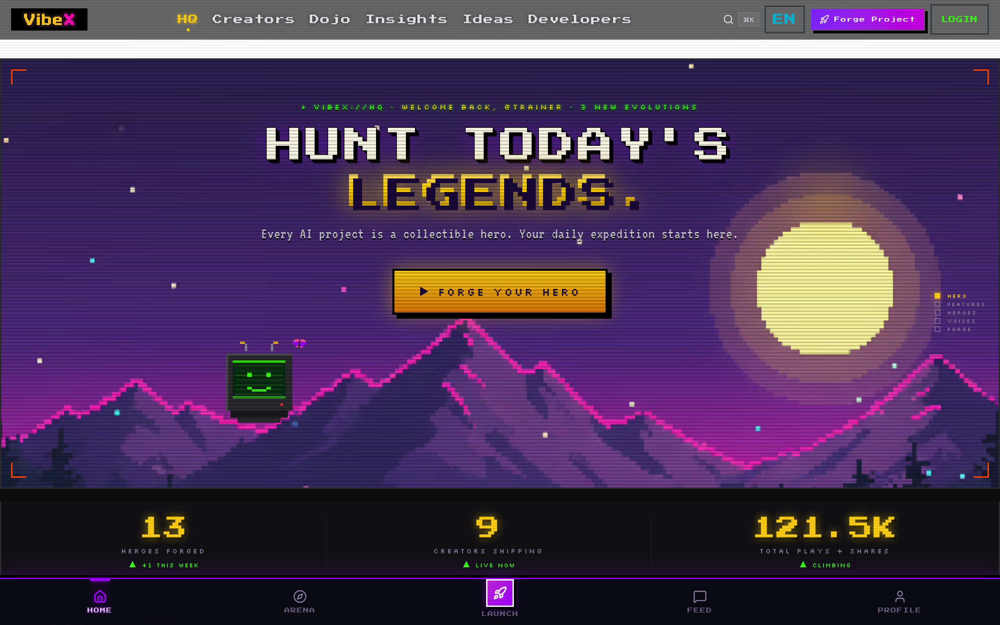
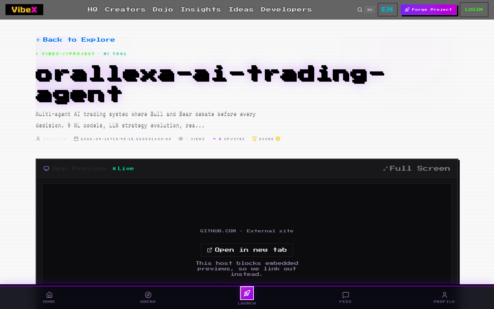
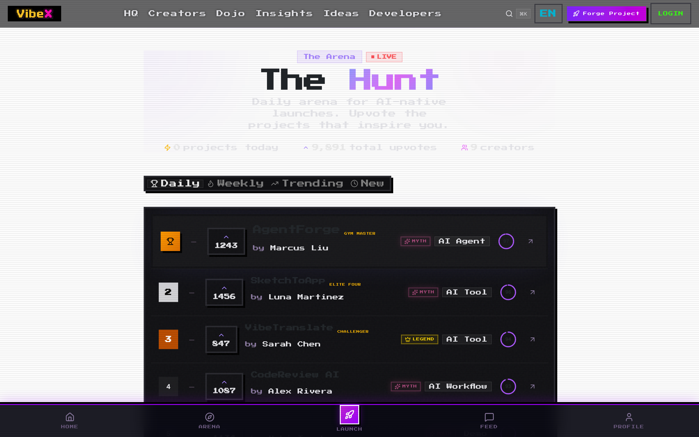
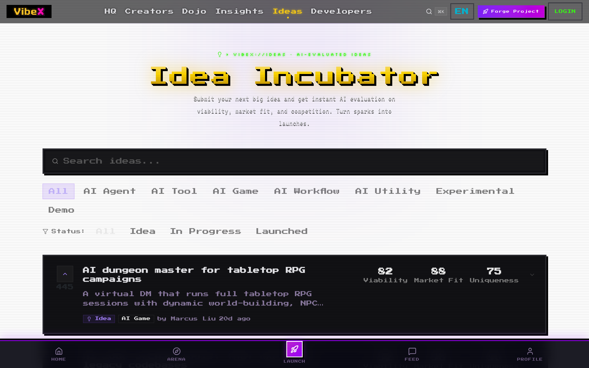
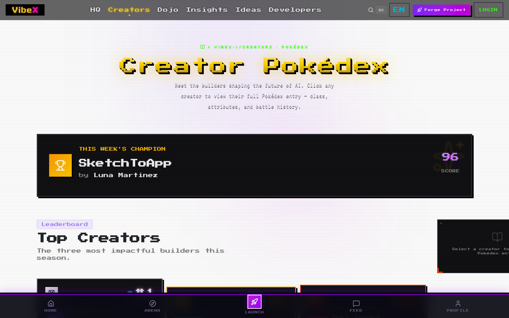

<p align="right">
  <a href="./README.md">English</a> · <strong>中文</strong>
</p>

<p align="center">
  
</p>

<h1 align="center">VibeX</h1>

<p align="center">
  <strong>Vibe Coding 项目的发射平台.</strong><br/>
  <sub>AI 时代的 Product Hunt, 自带 Claude 驱动的 launch review.</sub>
</p>

<p align="center">
  <a href="https://www.vibexforge.com/launch"></a>
  <a href="#-快速开始"></a>
  <a href="https://github.com/alex-jb/vibex"></a>
</p>

<p align="center">
  <a href="https://github.com/alex-jb/vibex"></a>
  <a href="https://github.com/alex-jb/vibex/commits"></a>
  <a href="https://nextjs.org"></a>
  <a href="https://supabase.com"></a>
  <a href="https://anthropic.com"></a>
</p>

---

## Demo

https://github.com/alex-jb/vibex/releases/download/v0.1.0-demo/vibex-demo.mp4

> **在线版**: [vibexforge.com/launch](https://www.vibexforge.com/launch) — GitHub 登录, 贴任意 URL, 30 秒内看到真实的 Claude review.

---

## 要解决的问题

所有人都在 vibe coding. **造东西容易, 被看见才是瓶颈.**

你上线了一个 AI 项目, 发了链接, 没人点. 代码没问题, 但 landing page 标题弱, buzzword 太多, 陌生人 5 秒看不懂你是干嘛的. 独立开发者没有设计师, 没有文案, 也没有 growth advisor.

## 这个 Loop

VibeX 就是那个 advisor, 由 Claude 驱动.

**1. Forge** — 贴你的项目 URL. 我们抓页面, 解析 pitch, 索引 README.

**2. Review** — Claude 以第一次访客的视角读完, 返回 5-7 条结构化 action. 每条带清晰的标题, 为什么值得做, 和可以直接复制粘贴的建议.

**3. Apply** — 点 Apply 入日志. 下周回来再跑一次, 看分数有没有涨.

整个产品就这个闭环.

游戏化的外壳 (进化阶段, 稀有度, 像素风 chrome) 是为了让审稿这件事感觉像游戏不像作业.

---

## Demo

**在线版**: [vibexforge.com/launch](https://www.vibexforge.com/launch) — GitHub 登录, 贴任意 URL, 30 秒内看到真实的 Claude review.

|  |  |
|---|---|
|  |  |
| **传送门** — 每次进入的起点 | **HQ** — 你的项目 + 今日 leaderboard |
|  |  |
| **项目详情** — review 历史 + 数据 | **Hunt** — 每日 / 每周排行 |
|  |  |
| **Idea Lab** — 想法动手前先打个分 | **Creators** — 项目背后的人 |

---

## 快速开始

**30 秒起飞, 零配置.** 不需要 API key, 不需要数据库, 不需要注册.

```bash
git clone https://github.com/alex-jb/vibex.git
cd vibex
npm install
npm run dev
```

打开 http://localhost:3000. 默认跑在 **mock 模式**, 带内置的 demo 数据, 你可以完全不配 Supabase + Claude 就把每个页面看一遍.

<details>
<summary><strong>想跑真数据? 接一下 Supabase + Claude (可选)</strong></summary>

```bash
cp .env.local.example .env.local
# 填入:
#   NEXT_PUBLIC_SUPABASE_URL
#   NEXT_PUBLIC_SUPABASE_ANON_KEY
#   ANTHROPIC_API_KEY
npm run dev
```

然后在 Supabase Dashboard 的 SQL Editor 里跑 `supabase/migrations/*.sql` 里的 migration. 详细流程见 [CONTRIBUTING.md](./CONTRIBUTING.md).

</details>

---

## 技术栈

| 层 | 选型 | 为什么 |
|---|---|---|
| 框架 | Next.js 16 (App Router, Turbopack) | Server Components + streaming |
| 语言 | TypeScript 5 (strict) | 重构不慌 |
| UI | React 19 + Tailwind v4 + Framer Motion | 零配置, 快, 动效顺 |
| 设计 | nes-core.css + 本地 rpgui + 自定义像素 token | 16 位复古感, CSS ~50KB |
| 数据库 | Supabase (Postgres + RLS + Realtime) | 一套栈, 一套 auth, realtime 开箱即用 |
| Auth | Supabase Auth (GitHub + Google OAuth + PKCE) | Cookie, 不是 localStorage — SSR 友好 |
| AI | Anthropic Claude Sonnet 4.6 + tool_use | 结构化 JSON review, 不是流水账 |
| 监控 | Sentry + PostHog | 错误 + 产品数据 |
| 部署 | Vercel + GitHub Actions | `git push` 就是 prod |

---

## 架构

```
vibex/
├── app/                      # Next.js 16 App Router
│   ├── page.tsx              # Landing (传送门)
│   ├── home/                 # HQ dashboard (登陆后)
│   ├── hunt/                 # Realtime leaderboard
│   ├── launch/               # Forge 一个 project → AI review
│   ├── project/[id]/         # 项目详情 + review 历史
│   ├── ideas/                # Idea Lab (动手前先打分)
│   ├── creators/             # 创作者 profile + 排行
│   └── api/                  # REST + streaming endpoint
├── components/
│   ├── ui/                   # shadcn 衍生的基础组件
│   ├── rpg/                  # 像素外壳 (卡片, 进化 badge)
│   ├── demo/                 # Embed/preview helper
│   └── ideas/                # Idea Lab 组件
├── lib/
│   ├── ai.ts                 # Claude tool_use 封装
│   ├── realtime.ts           # Supabase realtime hook (per-mount useId)
│   ├── use-data.ts           # 数据 fetch (mock + 真数据)
│   └── i18n.ts               # 双语 UI (EN / zh)
├── proxy.ts                  # Next 16 middleware (Supabase SSR auth)
├── supabase/migrations/      # 公开 schema 残桩
└── .private/migrations/      # 真实 schema + RLS 策略 (不在 repo 里)
```

**数据流**: 浏览器 → Next.js proxy (auth) → API route → Supabase + Claude → 流式返回.

---

## Roadmap

**已上线**
- [x] GitHub + Google OAuth (PKCE + cookie)
- [x] 项目提交 + URL scrape + cleanTitle
- [x] Claude 结构化 review (每次 5-7 条 action)
- [x] Apply / Skip / Reject action 落库持久化
- [x] `postgres_changes` 订阅的实时 leaderboard
- [x] nes-core + 自定义复古 token 的像素风 UI
- [x] 中英双语 (EN / zh, 708 条 string)

**在做**
- [ ] 拉前 10 个真实用户走完 loop
- [ ] 每周 re-review 提醒 (让人回来)
- [ ] 创作者主页的 public review feed

**以后**
- [ ] 多模型互审 (Claude + GPT + Gemini 交叉检查)
- [ ] 低风险文案自动 Apply (带 diff 预览)
- [ ] Creator → creator 同行审稿市场

---

## License & 源代码模型

VibeX 是 **source-available**, 不是完全意义上的开源.

### 公开 (这个 repo)
所有 UI, 页面, API route, 组件. 核心逻辑的公共 stub, 装完能跑 (用 demo 数据). Schema overview.

### 私有 (不在这个 repo)
- Claude prompt 模板和 tool schema
- 打分 + 进化 tuning
- Growth intelligence 算法
- 带 RLS 策略的完整 migration 历史

**你可以**: fork, 学习, 本地跑, 给公开部分提 PR.
**你不可以**: 不经许可商用. 见 [LICENSE](./LICENSE).

---

## 当前状态

2026-04-16 上线了 Launch Feedback Loop. 首个真实用户提交 (一个 AI 交易 agent repo) 端到端跑通了: URL 抓取 → 标题清洗 → Claude 返回 7 条 action → 通过 RLS 保护写入 Supabase.

现在在找下一组 9 个用户, 验证 review 到底有没有用, 不是看它能不能跑.

**这周要上线 AI 项目的话**: [在你自己的 URL 上跑一下](https://www.vibexforge.com/launch), 把 Claude 给你的 action 发给我. 我想知道哪些真的落地了, 哪些没 get 到.

---

<p align="center">
  由 <a href="https://github.com/alex-jb">Orallexa</a> 以 vibe coding 的能量打造<br/>
  <a href="https://www.vibexforge.com"></a>
</p>
